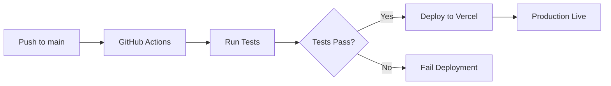

# Vercel Deployment Setup Guide

## 📋 Prerequisites

1. A GitHub account with your code repository
2. A Vercel account (sign up at https://vercel.com)
3. Your repository pushed to GitHub

## 🔑 Step 1: Get Vercel Credentials

### Option A: Using Vercel CLI (Recommended)

1. **Install Vercel CLI**:
   ```bash
   npm install -g vercel
   ```

2. **Login to Vercel**:
   ```bash
   vercel login
   ```

3. **Link your project** (run from project root):
   ```bash
   vercel link
   ```
   - Follow the prompts to create or link to a project
   - This creates a `.vercel` folder with project details

4. **Get your credentials**:
   ```bash
   # View your project settings
   cat .vercel/project.json
   ```
   You'll see:
   - `orgId` → This is your `VERCEL_ORG_ID`
   - `projectId` → This is your `VERCEL_PROJECT_ID`

5. **Get your Vercel Token**:
   - Go to: https://vercel.com/account/tokens
   - Click "Create Token"
   - Name it: `GitHub Actions`
   - Set scope: `Full Account`
   - Copy the token → This is your `VERCEL_TOKEN`

### Option B: Via Vercel Dashboard

1. **Create/Import Project**:
   - Go to https://vercel.com/new
   - Import your GitHub repository
   - Note the project name

2. **Get Organization ID**:
   - Go to https://vercel.com/account
   - Copy your Team/Account ID → This is `VERCEL_ORG_ID`

3. **Get Project ID**:
   - Go to your project settings
   - Settings → General
   - Scroll to "Project ID"
   - Copy the ID → This is `VERCEL_PROJECT_ID`

4. **Create Token**:
   - Go to https://vercel.com/account/tokens
   - Create new token → This is `VERCEL_TOKEN`

## 🔐 Step 2: Add Secrets to GitHub

1. **Go to your GitHub repository**
2. **Navigate to Settings → Secrets and variables → Actions**
3. **Click "New repository secret"**
4. **Add these three secrets**:

   | Name | Value | Where to get it |
   |------|-------|-----------------|
   | `VERCEL_TOKEN` | Your Vercel API token | https://vercel.com/account/tokens |
   | `VERCEL_ORG_ID` | Your organization/team ID | From Vercel dashboard or `.vercel/project.json` |
   | `VERCEL_PROJECT_ID` | Your project ID | From project settings or `.vercel/project.json` |

5. **Add environment variables** (optional but recommended):

   | Name | Value | Description |
   |------|-------|-------------|
   | `VITE_API_URL` | Your backend API URL | e.g., `https://api.yourbackend.com` |

## 🚀 Step 3: Configure Vercel Project

### In Vercel Dashboard:

1. **Go to your project** on Vercel
2. **Settings → Environment Variables**
3. **Add**:
   - `VITE_API_URL` = Your backend API URL
   - Set for: `Production`, `Preview`, and `Development`

### Configure Build Settings (Auto-detected, but verify):

- **Framework Preset**: Vite
- **Build Command**: `npm run build`
- **Output Directory**: `dist`
- **Install Command**: `npm install`

## 📝 Step 4: Update Repository (Already Done ✅)

The following files are already configured in your repository:

- ✅ `.github/workflows/deploy.yml` - Production deployment
- ✅ `.github/workflows/preview.yml` - PR preview deployments
- ✅ `.github/workflows/ci.yml` - Quality checks
- ✅ `vercel.json` - Vercel configuration

## 🎯 Step 5: Test the Deployment

### Automatic Deployments:

1. **Production Deployment**:
   ```bash
   git add .
   git commit -m "Setup Vercel deployment"
   git push origin main
   ```
   - This triggers `.github/workflows/deploy.yml`
   - Deploys to production on Vercel

2. **Preview Deployment**:
   - Create a pull request
   - This triggers `.github/workflows/preview.yml`
   - Creates a preview deployment
   - Comments the preview URL on the PR

### Manual Deployment (Alternative):

```bash
# Deploy to preview
vercel

# Deploy to production
vercel --prod
```

## ✅ Verification Checklist

- [ ] Vercel account created
- [ ] Project linked to Vercel
- [ ] `VERCEL_TOKEN` added to GitHub secrets
- [ ] `VERCEL_ORG_ID` added to GitHub secrets
- [ ] `VERCEL_PROJECT_ID` added to GitHub secrets
- [ ] `VITE_API_URL` set in Vercel environment variables
- [ ] Code pushed to GitHub main branch
- [ ] GitHub Actions workflow running
- [ ] Deployment successful
- [ ] Application accessible at Vercel URL

## 🔍 Monitoring Deployments

### Via GitHub:
- Go to your repository
- Click "Actions" tab
- View workflow runs

### Via Vercel:
- Go to https://vercel.com/dashboard
- Click your project
- View deployments

## 🐛 Troubleshooting

### Deployment fails with "Invalid token"
- Verify `VERCEL_TOKEN` is correct
- Create a new token if needed
- Ensure token has proper permissions

### "Project not found"
- Check `VERCEL_PROJECT_ID` matches your project
- Verify `VERCEL_ORG_ID` is correct
- Run `vercel link` to re-link

### Build fails
```bash
# Test locally first
npm run build

# Check logs in GitHub Actions
# Or in Vercel dashboard
```

### Environment variables not working
- Ensure they start with `VITE_` prefix
- Set for all environments (Production, Preview, Development)
- Redeploy after adding variables

### Tests fail in CI
```bash
# Run tests locally
npm run test:ci

# Check specific failing test
npm test -- --verbose
```

## 📊 Deployment Workflow



## 🎉 Success!

Once everything is set up:
- ✅ Every push to `main` deploys to production
- ✅ Every PR gets a preview deployment
- ✅ Tests run before deployment
- ✅ Environment variables injected automatically
- ✅ Instant rollbacks available in Vercel dashboard

## 📚 Additional Resources

- **Vercel CLI Docs**: https://vercel.com/docs/cli
- **GitHub Actions**: https://docs.github.com/actions
- **Vercel Deployments**: https://vercel.com/docs/deployments
- **Environment Variables**: https://vercel.com/docs/environment-variables

---

Need help? Check the [DEPLOYMENT.md](DEPLOYMENT.md) for more details!
